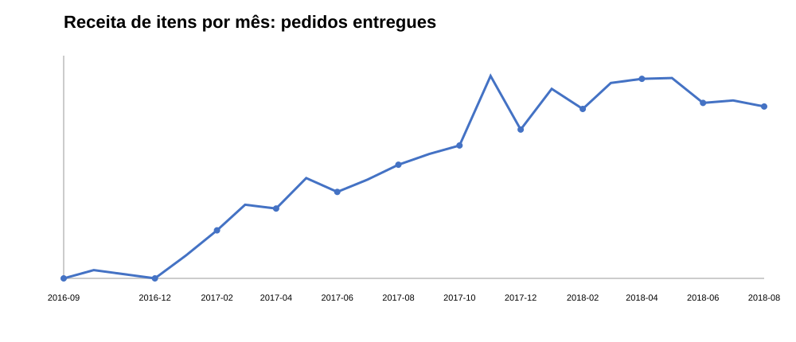
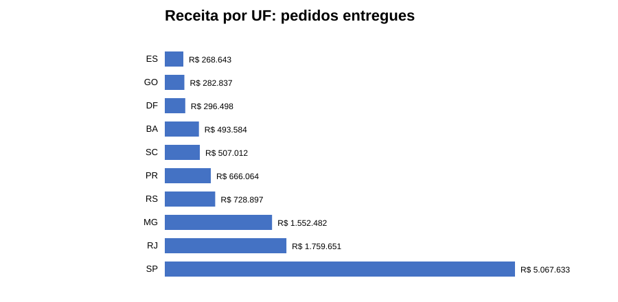
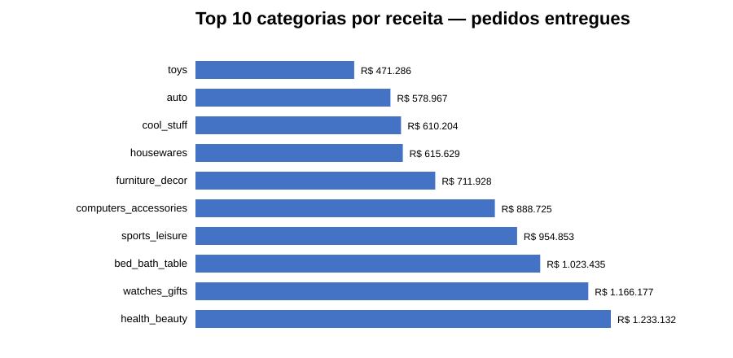

# Análise de vendas e faturamento com Python

[](https://github.com/peedrovinicius/analise-vendas-python/actions/workflows/ci.yml)


Projeto de engenharia e análise de dados construído a partir do **Brazilian E-Commerce Public Dataset by Olist**, uma base pública e anonimizada de comércio eletrônico brasileiro.

## Sobre o projeto

O projeto demonstra um fluxo completo de dados em Python, incluindo ingestão, validação de schema, transformação, cálculo de indicadores, testes automatizados, análise de qualidade e documentação dos resultados.

A versão atual utiliza exclusivamente os dados públicos da Olist.

## Objetivos analíticos

A análise responde a questões sobre:

- receita e volume de pedidos entregues;
- evolução mensal da receita;
- concentração geográfica das vendas;
- categorias com maior participação na receita;
- recorrência de clientes;
- concentração de receita entre vendedores.

## Resultados validados

A execução atual foi recalculada sobre os nove arquivos públicos da Olist e reproduziu os indicadores registrados na análise inicial:

- **96.478** pedidos entregues;
- **110.197** itens;
- **R$ 13.221.498,11** de receita dos itens;
- **R$ 2.198.275,64** de frete;
- **93.358** clientes únicos;
- **R$ 137,04** de ticket médio por pedido.

Os indicadores adicionais de segmentação, concentração geográfica, categorias, vendedores e evolução mensal estão documentados em [docs/insights-negocio.md](./docs/insights-negocio.md).

## Visualizações

### Evolução mensal



### Receita por estado



### Receita por categoria



As regras de leitura dessas visualizações estão documentadas em [docs/visualizacoes.md](./docs/visualizacoes.md).

## Fonte dos dados

**Brazilian E-Commerce Public Dataset by Olist**  
Fonte: https://www.kaggle.com/datasets/olistbr/brazilian-ecommerce

Detalhes da fonte, arquivos, características e licença estão documentados em [docs/fonte-dados.md](./docs/fonte-dados.md).

## Modelo e qualidade dos dados

A análise utiliza `order_items` como referência transacional no nível de item de pedido. Os relacionamentos com pedidos, clientes, produtos, categorias e vendedores são controlados para preservar a granularidade.

Pagamentos e avaliações não são unidos diretamente à tabela de itens sem tratamento específico de cardinalidade.

A auditoria e as regras de qualidade estão documentadas em [docs/qualidade-dados.md](./docs/qualidade-dados.md).

## Principais decisões de negócio

Para os KPIs de receita realizada, são considerados itens pertencentes a pedidos com status `delivered`.

`price` representa a receita dos itens. `freight_value` é apresentado separadamente e não é tratado automaticamente como receita de produto.

Pedidos com outros status permanecem disponíveis para análises operacionais, mas não entram no KPI de receita realizada definido nesta versão.

## Documentação

- [Metodologia](./docs/metodologia.md)
- [Engenharia do projeto](./docs/engenharia.md)
- [Execução local](./docs/execucao-local.md)
- [Fonte dos dados](./docs/fonte-dados.md)
- [Modelo de dados](./docs/modelo-dados.md)
- [Qualidade dos dados](./docs/qualidade-dados.md)
- [Insights de negócio](./docs/insights-negocio.md)
- [Auditoria inicial](./docs/auditoria-inicial.md)
- [Visualizações](./docs/visualizacoes.md)
- [Storytelling](./docs/storytelling.md)

## Estrutura

```text
.
├── dados/
│   ├── raw/
│   └── processed/
├── docs/
│   ├── auditoria-inicial.md
│   ├── engenharia.md
│   ├── execucao-local.md
│   ├── fonte-dados.md
│   ├── insights-iniciais.md
│   ├── insights-negocio.md
│   ├── metodologia.md
│   ├── modelo-dados.md
│   ├── qualidade-dados.md
│   ├── storytelling.md
│   └── visualizacoes.md
├── notebooks/
│   └── analise_olist.ipynb
├── assets/
│   ├── evolucao-mensal.svg
│   ├── receita-por-uf.svg
│   └── receita-por-categoria.svg
├── scripts/
│   ├── auditar_olist.py
│   └── run_pipeline.py
├── src/
│   ├── analytics/
│   ├── ingestion/
│   ├── transformation/
│   ├── validation/
│   └── pipeline.py
├── tests/
│   ├── test_olist_transformation.py
│   └── test_sales_analysis.py
├── requirements.txt
├── pyproject.toml
└── README.md
```

## Pipeline e qualidade de software

A execução oficial é centralizada em `src/pipeline.py`, responsável por coordenar ingestão, validação, transformação e cálculo dos KPIs.

O projeto possui CI automatizado com Ruff, mypy, pytest + coverage, pip-audit e pre-commit.

## Execução local

Para reproduzir a análise localmente:

```bash
git clone https://github.com/peedrovinicius/analise-vendas-python.git
cd analise-vendas-python
python -m venv .venv
```

Ative o ambiente virtual conforme o seu sistema e instale as dependências:

```bash
python -m pip install -r requirements.txt
python -m pip install -e .
```

Coloque os nove arquivos CSV da Olist em `dados/raw/` e execute:

```bash
python scripts/run_pipeline.py
```

A análise exploratória pode ser aberta em `notebooks/analise_olist.ipynb`. O fluxo completo e os detalhes de reprodução estão descritos em [docs/execucao-local.md](./docs/execucao-local.md).

## Notebook

A análise exploratória e a apresentação dos resultados estão em [notebooks/analise_olist.ipynb](./notebooks/analise_olist.ipynb).

## Status

**Análise e pipeline validados.**

A base técnica atual está preparada para futuras evoluções de visualização ou publicação como aplicação, mantendo as regras analíticas consolidadas na camada `src/`.

## Limitações

- Receita não representa lucro ou margem.
- Os KPIs de receita realizada consideram pedidos com `order_status = delivered`.
- A série temporal utiliza a data de compra.
- A cobertura de 2016 e 2018 é parcial.
- A recorrência é calculada apenas sobre o histórico disponível no dataset e não representa, isoladamente, retenção ou churn.
- Não são feitas inferências causais a partir das diferenças descritivas observadas.
