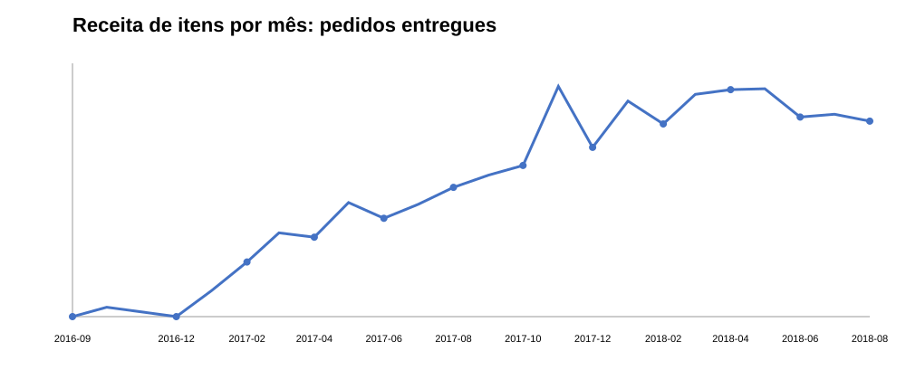
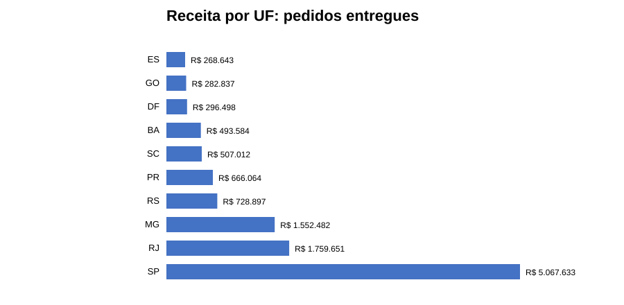
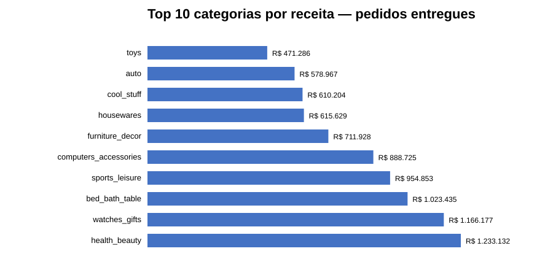

# Visualizações analíticas

As visualizações desta etapa são geradas a partir da fato analítica de itens associados a pedidos com status `delivered`.

Os três SVGs publicados em `assets/` podem ser regenerados com:

```bash
python scripts/generate_visualizations.py
```

O script reutiliza as funções analíticas do projeto, evitando manter gráficos desconectados das regras de cálculo usadas nos KPIs.

## 1. Evolução mensal



Mostra a receita de itens por mês de compra. Meses sem registros não são preenchidos artificialmente.

## 2. Concentração por estado



Apresenta os 10 estados com maior receita, considerando o estado do cliente.

## 3. Concentração por categoria



Apresenta as 10 categorias com maior receita dos itens entregues.

## Regras de leitura

- Receita considera `price` dos itens de pedidos entregues.
- Frete é tratado separadamente.
- O ranking por UF utiliza `customer_state`, não `seller_state`.
- As visualizações não devem ser interpretadas como causalidade: mostram associação e concentração observadas na base.
